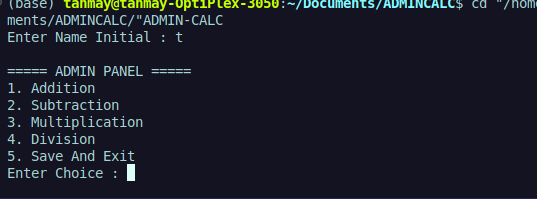
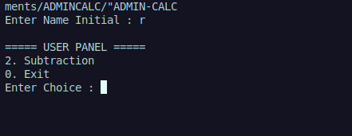

# AdminCalc 

AdminCalc is a menu-driven calculator written in C that allows an administrator to enable or disable calculator operations. Users can only access the operations that have been permitted by the administrator.

---

## Features

✔ Admin Panel

✔ Enable / Disable Operations

✔ File Handling for Persistent Settings

✔ Addition

✔ Subtraction

✔ Multiplication

✔ Division

✔ Division by Zero Protection

✔ Menu Driven Interface

---

## How It Works

### Admin Mode

If the user enters:

```text
T
```

or

```text
t
```

the program enters Admin Mode.

The administrator can:

- Enable Addition
- Enable Subtraction
- Enable Multiplication
- Enable Division
- Save Settings

All settings are stored inside:

```text
settings.dat
```

---

### User Mode

Any other initial will enter User Mode.

Example:

```text
A
K
R
M
```

Users can only see operations that were enabled by the administrator.

---

## Project Flow

```text
START
  |
Load Settings
  |
Enter Initial
  |
  +---- Admin (T/t)
  |         |
  |    Configure Operations
  |         |
  |    Save Settings
  |
  +---- User
            |
      View Enabled Operations
            |
      Perform Calculations
            |
           Exit
```

---

## Technologies Used

- C Programming
- Structures
- File Handling
- Loops
- Conditional Statements
- Menu Driven Programming

---

## Screenshots

### Admin Panel



### User Panel



### Calculation Example


---

## File Structure

```text
AdminCalc/
│
├── main.c
├── settings.dat
├── README.md
└── images/
```

---

## Learning Concepts

This project helped me practice:

- Structures
- File Handling
- Binary Files
- Loops
- Conditional Statements
- User Access Control
- Menu Driven Programs

---

## Future Improvements

- Admin Password Authentication
- Square Root Operation
- Power Operation
- Percentage Calculator
- Calculation History
- User Accounts
- Better UI

---

## Build & Run

Compile:

```bash
gcc main.c -o admincalc
```

Run:

```bash
./admincalc
```

---

## Author

Tanmay Khanna

Built as a learning project while exploring C programming, file handling, and menu-driven software development.
